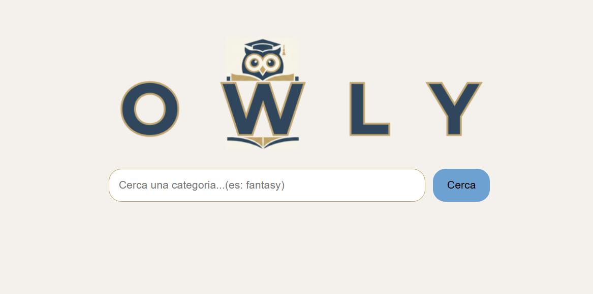

# OWLY - Motore di ricerca libri



[](https://developer.mozilla.org/en-US/docs/Web/HTML)
[](https://developer.mozilla.org/en-US/docs/Web/CSS)
[](https://developer.mozilla.org/en-US/docs/Web/JavaScript)
[](https://progetto-javascript-di-paloma-fuerte.netlify.app)

## Descrizione del progetto

Owly è una semplice applicazione web in JavaScript puro che permette di cercare libri per categoria utilizzando le API pubbliche di Open Library.  
L'interfaccia mostra dinamicamente i titoli dei libri e i rispettivi autori. Cliccando su un libro si apre un overlay con la descrizione completa del libro.

## Tecnologie utilizzate

- **HTML5** e **CSS3** per la struttura e lo stile della pagina
- **JavaScript** puro per la logica e manipolazione del DOM
- **Axios** per effettuare chiamate API esterne
- **Lodash** per gestione sicura dei dati
- **Webpack** per bundling di JS, CSS e assets
- **dotenv-webpack** per gestire variabili di ambiente
- Immagini create con **Canva**

## Funzionalità

- Ricerca libri per categoria (es. "fantasy", "history", "romance")
- Visualizzazione dinamica dei titoli e autori
- Overlay con descrizione completa del libro al click
- Supporto a tastiera (Enter per cercare)
- Fallback quando i dati non sono disponibili

## Istruzioni per eseguire il progetto localmente

1. Clona il repository sul tuo computer:

```bash
git clone https://PalomaFuerte.github.io/Progetto-JavaScript-Advanced-di-Miriam-Paloma-Fuerte-Contreras/.git
```

2. Apri la cartella del progetto.
3. Assicurati di avere Node.js installato.
4. Installa le dipendenze:

```bash
npm install
```

5. Avvia Webpack per generare il bundle:

```bash
npx webpack
```

3. Apri il file index.hmtl con un browser moderno (Chrome, Firefox, Edge, Safari).
4. Inserisci una categoria nella barra di ricerca e clicca "Cerca" o premi Enter.
5. Clicca su un libro per vedere la sua descrizione completa.

In alternativa, puoi visualizzare il progetto direttamente online:
Owly di Paloma Fuerte

## Contatti

Puoi contattarmi attraverso i seguenti canali:
Puoi contattarmi attraverso i seguenti canali:

**Email:** lefortbyfuerte@gmail.com
**GitHub:** [Paloma Fuerte](https://github.com/PalomaFuerte)
**LinkedIn:** [Paloma Fuerte](https://www.linkedin.com/in/paloma-fuerte-073160242/)
**Instagram:** [Paloma Fuerte](https://www.instagram.com/fuertepaloma)
